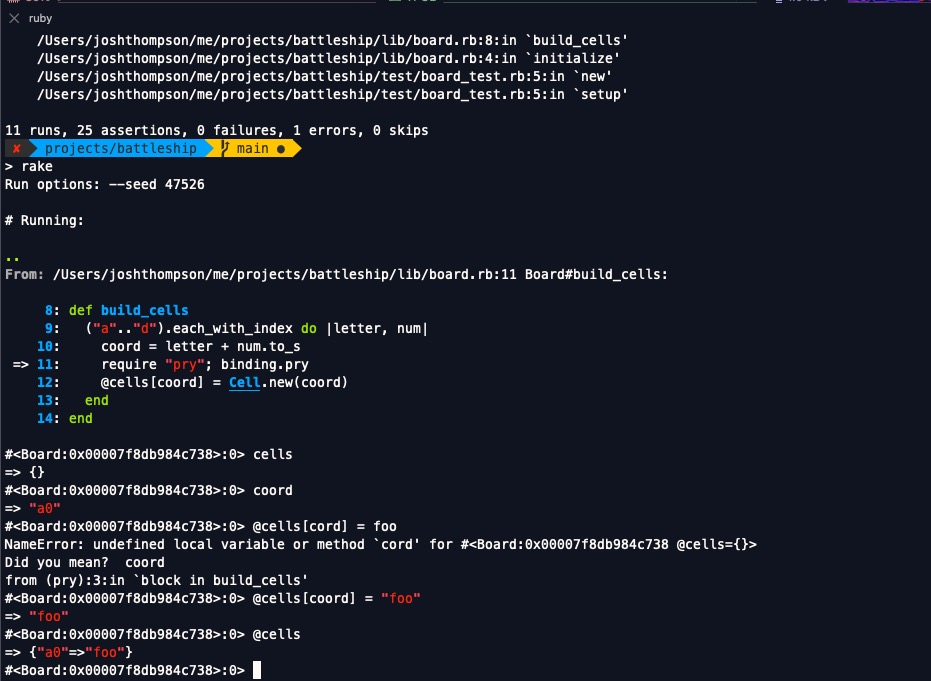
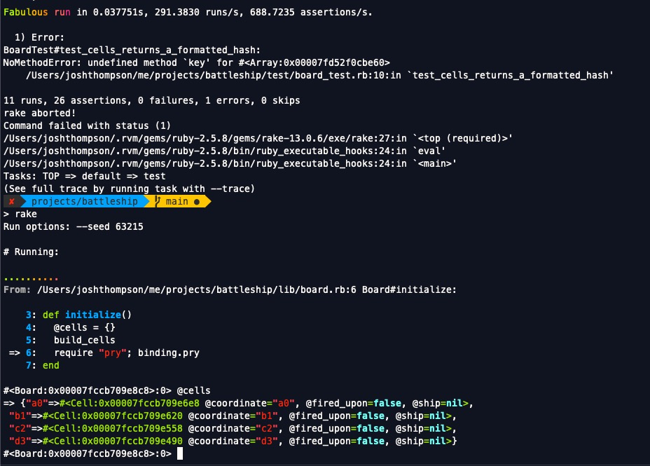

# An excruciatingly-detailed but hopefully comprehensive walkthrough

In the same style as I [did a walk-through](https://github.com/josh-works/futbol) of Turing's Futbol project, I'm doing the same on this Battleship project.

Project home: [https://backend.turing.edu/module1/projects/battleship/requirements](https://backend.turing.edu/module1/projects/battleship/requirements)

I am making this from scratch, and will explain every commit. Hopefully, elements of my process and approach will be fruitful to others. 

For context, I graduated from Turing in 2017, and have been working in Ruby/Rails ever since. I'm not an expert, but I've written a lot of code that's in production in various places, and been paid well for it. 

I'm optimizing for speed, here, because I don't have much time. 

It's 9:35 AM, 2021-10-22, and I'm 3 minutes into this project. I'll keep a bit of a running timeline as I go, because that can be useful. I have a meeting in 22 min, hope to be done with I1 by then.

Current commit: `https://github.com/josh-works/battleship/commit/42d782d`

----------------

# Housekeeping

This document is meant to be read and worked through top-to-bottom, and as much as possible, I've captured stream-of-conciousness kind of stuff. I really want to make legible my process, as an aid to others. 

This is the kind of learning I do particularly well with, when pairing with experts, so I'm more-or-less building a resource that I wish already existed. 

I believe _speed_ is important, because if you feel like you can move quickly and confidently, you can do a lot. 

That's why I try to make it clear how much time I'm spending on this, as I go. As I write this word, I'm a little over one hour into this project, and I'm just about to start Iteration 2. That's why I include links to specific commits, so you can see how and why this code/repository has changed. 

If you feel like your time is particularly slow compared to this, you should "move slowly" and try to pick up as much as you can. It's worth going slowly.

> Slow is smooth, and smooth is fast.

_Off to Iteration 2!_


# Iteration 1:

## Basic setup

We've got an interaction pattern. At minimum, a ship and a cell. I can see what methods it'll respond to, so I'm going to frame both out (in the library _and_ test files) but leave it blank.

I ♥️ Minitest, so that's what I'll use.

First, I created four new files:

```
.
├── lib
│   ├── cell.rb
│   └── ship.rb
├── readme.md
└── test
    ├── cell_test.rb
    └── ship_test.rb
```

Next, I'll build a test_helper so I don't have to re-reference files.

Outlined a basic test in `ship_test.rb`, added/committed:

Current commit: `https://github.com/josh-works/battleship/commit/a6eca27`

## First ship test(s)

Lets make the test pass. 

here's the current test:

```ruby
require './test/test_helper'

class ShipTest < Minitest::Test
  def setup
    @ship = Ship.new("cruiser", 3)
  end
  
  def test_attributes
    assert_equal "cruiser", @ship.name
    assert_equal 3, @ship.length
    assert_equal 3, @ship.health
    # refute ship.sunk
  end
end
```

Added the basic ship structure:

```ruby
class Ship
  attr_reader :name, :length
  def initialize(name, length)
    @name = name
    @length = length
  end
end
```

## Ship#health

Now I need `Ship#health` to exist. Since length is fixed, but health isn't, I'm setting `@health` in initialization to the same value as `length`, and then I'll `-=` it as time goes on.

```ruby
class Ship
  attr_reader :name, :length, :health
  def initialize(name, length)
    @name = name
    @length = length
    @health = length
  end
end
```
Now `Ship#sunk?` should prob return false as long as `health` is `> 0`:

Here's the test:

```ruby
class ShipTest < Minitest::Test
  def setup
    @ship = Ship.new("cruiser", 3)
  end
  
  def test_attributes
    assert_equal "cruiser", @ship.name
    assert_equal 3, @ship.length
    assert_equal 3, @ship.health
    refute @ship.sunk?
  end
end
```

and the class:

```ruby
class Ship
  attr_reader :name, :length, :health
  def initialize(name, length)
    @name = name
    @length = length
    @health = length
  end
  
  def sunk?
    health == 0  # returns false unless health is 0. Neat huh?
  end
end
```

Current commit: `https://github.com/josh-works/battleship/commit/3dcdbe0`


OK, so the ship is outlined, now we need ways to "interact" with it. 

## `Ship#hit`

The interaction pattern has this:

```ruby
> cruiser.sunk?
#=> false

> cruiser.hit

> cruiser.health
#=> 2

> cruiser.hit

> cruiser.health
#=> 1

> cruiser.sunk?
#=> false

> cruiser.hit

> cruiser.sunk?
#=> true
```
I'm adding this test:

```ruby
def test_ship_can_be_hit_and_sunk
  @ship.hit
  assert_equal 2, @ship.health
  refute @ship.sunk?
  
  @ship.hit
  @ship.hit
  
  assert_equal 0, @ship.health
  assert @ship.sunk?
end
```

Now I need to add the `hit` method:

```ruby
class Ship
  attr_reader :name, :length, :health
  def initialize(name, length)
    @name = name
    @length = length
    @health = length
  end
  
  def sunk?
    health == 0
  end
  
  def hit
    @health -= 1
  end
end
```

And the tests pass. That finishes our ship interaction pattern.

Current commit: https://github.com/josh-works/battleship/commit/908fef9

-----------------

## `Cell` tests

3 minutes left before my meeting... onward!

ok, meeting time, here's my test. I'll make it pass after:

```ruby
require './test/test_helper'

class CellTest < Minitest::Test
  def setup
    @cell = Cell.new("B4")
    @cruiser = Ship.new("Cruiser", 3)
  end
  
  def test_basic_attributes
    assert_equal "B4", @cell.coordinate
    assert_nil @cell.ship
    assert @cell.empty?
  end
  
  def test_place_ship_places_ship
    @cell.place_ship(@cruiser)
    assert_equal @cruiser, @cell.ship
    refute @cell.empty?
  end
end
```

-------------

Meeting's over, lets push a bit farther:

Quickly outlined the `Cell`:

```ruby
class Cell
  attr_reader :coordinate, :ship, :empty
  def initialize(coordinate)
    @coordinate = coordinate
    @ship = nil
    @empty = true
  end
  
  def empty?
    empty
  end
end
```

## `Cell#place_ship(ship)`

Now lets deal with `place_ship`:

```ruby
# test/cell_test.rb
def test_place_ship_places_ship
  @cell.place_ship(@cruiser)
  assert_equal @cruiser, @cell.ship
  refute @cell.empty?
end
```

I'm going to refactor the `empty?` method - taking it out of the initialize method, and instead reading the `@ship` ivar (instance variable), and "doing logic" on that:

```ruby
class Cell
  attr_reader :coordinate, :ship
  def initialize(coordinate)
    @coordinate = coordinate
    @ship = nil
  end
  
  def empty?
    true unless ship # I don't love this, but it gives me what I want.
  end
  
  def place_ship(ship)
    @ship = ship
  end
end
```

All tests pass, I'm at 

https://github.com/josh-works/battleship/commit/66850d5

---------------

## `Cell#fired_upon?`

From iteration 1:

> Additionally, a cell knows when it has been fired upon. When it is fired upon, the cell’s ship should be damaged if it has one:

I'm slimming down the interaction pattern a bit:

```ruby
> cell = Cell.new("B4")
# => #<Cell:0x00007f84f0ad4720...>

> cruiser = Ship.new("Cruiser", 3)
# => #<Ship:0x00007f84f0891238...>

> cell.place_ship(cruiser)

> cell.fired_upon?
# => false

> cell.fire_upon

> cell.ship.health
# => 2

> cell.fired_upon?
# => true
```

Without having any idea how you might implement this, you can still write the tests:

```ruby
def test_cell_can_be_fired_upon_and_know_about_it
  @cell.place_ship(@cruiser)
  
  refute @cell.fired_upon?
  
  @cell.fire_upon
  
  assert @cell.fired_upon?
  assert_equal 2, @cruiser.health
end
```

Now, we are adding two methods to the `Cell` class, so lets outline those methods in the class, so when we run the tests we don't get `MethodNotFound`:

```ruby
# lib/cell.rb

class Cell
  attr_reader :coordinate, :ship
  def initialize(coordinate)
    @coordinate = coordinate
    @ship = nil
  end
  
  def empty?
    true unless ship
  end
  
  def place_ship(ship)
    @ship = ship
  end
  
  def fired_upon?
    
  end
  
  def fire_upon
  end
end
```

Now we're just getting `nil` when we expect other things from the tests. 

Did you do all this yourself, by the way? Are you running the tests in your editor regularly? I expect you to do so, and be "following along" with me, by reproducing everything in your own editor.

Now, I want to be able to call something very simple in `fired_upon?`. Like `ship.any_damage?`

Obviously I could do logic on the ship from the `Cell` class, like:

```ruby
# lib/cell.rb
def fired_upon?
  true if ship.health < ship.length
end
```

But I'd rather do:

```ruby
def fired_upon?
  ship.damaged?
end
```

which requires us to add a `damaged` method (and test) to our ship class...

Nevermind, I'm going to make `fired_upon` read from an instance variable. This is a `cell`, a specific coordinate, it doesn't need to know if the ship has been hit in other spots.

Here's what I've got now:

```ruby
class Cell
  attr_reader :coordinate, :ship, :fired_upon
  def initialize(coordinate)
    @coordinate = coordinate
    @ship = nil
    @fired_upon = false
  end
  
  def empty?
    true unless ship
  end
  
  def place_ship(ship)
    @ship = ship
  end
  
  def fired_upon?
    fired_upon
  end
  
  def fire_upon
    @fired_upon = true # toggles the value in the cell
    ship.hit           # causes the ship to record some damage
  end
end
```

All looks good, tests pass. 

https://github.com/josh-works/battleship/commit/e930918

## Adding a `Rakefile` to make running tests easy

Now that I have two test files, I'm going to add a Rake file that allows me to run `rake test` and run tests against each file in the `test` directory:

I use this task regularly, so I copied-and-pasted from another project where I use the Rake task. There's a StackOverflow answer to `how to run all tests via rake` somewhere. 

Now I can do `rake` or `rake test` in the terminal, and all tests are run:

https://github.com/josh-works/battleship/commit/5c147d7

---------------------

## `Cell#render`

Lets build this `Cell#render` method...

> Finally, a Cell will have a method called render which returns a String representation of the Cell for when we need to print the board. A cell can potentially be rendered as:
> 
>     ”.” if the cell has not been fired upon.
>     “M” if the cell has been fired upon and it does not contain a ship (the shot was a miss).
>     “H” if the cell has been fired upon and it contains a ship (the shot was a hit).
>     “X” if the cell has been fired upon and its ship has been sunk.


so, our test will have things like:

```ruby
# cell_test.rb

def test_render_return_values
  
  # . if the cell has not been fired upon.
  # M if the cell has been fired upon and it does not contain a ship (the shot was a miss).
  # H if the cell has been fired upon and it contains a ship (the shot was a hit).
  # X if the cell has been fired upon and its ship has been sunk.

end
```

Now I'm going to "upgrade" each of these into some assertions, as far as I can:

```ruby
def test_render_return_values
  
  # . if the cell has not been fired upon.
  assert_equal ".", @cell.render
  # M if the cell has been fired upon and it does not contain a ship (the shot was a miss).
  assert_equal "M", @cell.render
  
  # H if the cell has been fired upon and it contains a ship (the shot was a hit).
  assert_equal "H", @cell.render
  
  # X if the cell has been fired upon and its ship has been sunk.
  assert_equal "X", @cell.render
end
```

Obviously this won't pass. Any cell by default won't be fired upon, so the first one should be easy to do. I then created an empty cell, and now the second `render` case should be passing:

```ruby
def test_render_return_values
  # . if the cell has not been fired upon.
  assert_equal ".", @cell.render
  
  empty_cell = Cell.new
  empty_cell.fire_upon
  # M if the cell has been fired upon and it does not contain a ship (the shot was a miss).
  assert empty_cell.empty?
  assert_equal "M", empty_cell.render
  
  # H if the cell has been fired upon and it contains a ship (the shot was a hit).
  assert_equal "H", @cell.render
  
  # X if the cell has been fired upon and its ship has been sunk.
  assert_equal "X", @cell.render
end
```

I had to slighly modify the test, to pass in coordinates to `Cell.new`, and I had to update the `fire_upon` method to only call `ship.hit` if there is, in fact, a ship:

```ruby
def fire_upon
  @fired_upon = true
  ship.hit if ship
end

def render
  return "." if !fired_upon?
end
```

Now the first portion of the test passes, and it's failing on the `assert_equal "M"`... line.

Progress!

Let's add a line with some aspirational code to the `render` method:

```ruby
def render
  return "." if !fired_upon?
  return "M" if fired_upon_empty_cell?
end
```

That's a method I didn't write, this `fired_upon_empty_cell?` thing. Here's the other way to write it:

```ruby
def render
  return "." if !fired_upon?
  return "M" if (fired_upon? && empty?)
end
```

But this is getting complicated, so lets do this:

```ruby
def render
  return "." if !fired_upon?
  return "M" if fired_upon_and_empty?
end

def fired_upon_and_empty?
  fired_upon? && empty?
end
```

We could write tests for these new methods, and maybe you should, but I'm not going to. I'm going to refactor the first line of `render` to be explicit:

```ruby
def render
  return "." if cell_has_not_been_fired_upon?
  return "M" if fired_upon_and_empty?
end

def cell_has_not_been_fired_upon?
  !fired_upon?
end

def fired_upon_and_empty?
  fired_upon? && empty?
end
```

You should be able to see how this is making things slightly clearer...

Now, in the test, we need to:

1. Add a ship to the cell
2. Fire upon that ship
3. Make some assertions about the results

Here's our test:

```ruby
def test_render_return_values
  # . if the cell has not been fired upon.
  assert_equal ".", @cell.render
  
  empty_cell = Cell.new("B5")
  empty_cell.fire_upon
  # M if the cell has been fired upon and it does not contain a ship (the shot was a miss).
  assert empty_cell.empty?
  assert_equal "M", empty_cell.render
  
  # H if the cell has been fired upon and it contains a ship (the shot was a hit).
  @cell.place_ship(@cruiser)     # place the ship
  @cell.fire_upon                # fire upon placed ship
  
  assert_equal "H", @cell.render # assert that ship shows it's been hit
  
  # X if the cell has been fired upon and its ship has been sunk.
  assert_equal "X", @cell.render
end
```

And here's the modified code:

```ruby
def render
  return "." if cell_has_not_been_fired_upon?
  return "M" if fired_upon_and_empty?
  return "H" if fired_upon_and_contains_ship?
end

def fired_upon_and_contains_ship?
  fired_upon? && ship
end
```

Ah, and for the last one, I need to bump the order - with return statements, as soon as a "matching" clause is arrived upon, the method exists. So, I need for the method to check if the ship is sunk (and exit if it is) before it checks to see if the cell has been fired upon and contains a ship.

Compare:

```ruby
def render
  return "." if cell_has_not_been_fired_upon?
  return "M" if fired_upon_and_empty?
  return "H" if fired_upon_and_contains_ship?
  return "X" if ship_has_been_sunk?
end
```

vs:

```ruby
def render
  return "." if cell_has_not_been_fired_upon?
  return "M" if fired_upon_and_empty?
  return "X" if ship_has_been_sunk?
  return "H" if fired_upon_and_contains_ship?
end
```

The 2nd `render` method is better than the first, and makes the test pass. That test is gnarly, though. I'll commit it, then refactor it into something clearer. Here's the pre-refactor version:

https://github.com/josh-works/battleship/commit/705a27d

## Refactoring the `Cell#render` test and method

Now I'm gonna refactor into more clearly labeled test cases. I did slight modifications, mostly just added `def test_` blocks within the prior test. After refactoring the test, I decided to re-name two of the methods inside of `render`:


https://github.com/josh-works/battleship/commit/71efefe

-------------

Phew, almost done with iteration 1, I've been at this for... 35 min so far? maybe? I love these projects. It's fun to sling so much code so quickly. Normally I spend all day to make like a 1-line change.

## `debug_mode` in `Cell#render`

Lets add the last piece of i1:

> Additionally, we will include an optional boolean argument to indicate if we want to reveal a ship in the cell even if it has not been fired upon. This should render a cell that has not been fired upon and contains a ship as an “S”. This will be useful for showing the user where they placed their ships and for debugging.


Here's my test:

```ruby
def test_render_in_debug_mode_reveals_ship_location
  @cell.place_ship(@cruiser)
  empty_cell = Cell.new("C2")
  
  assert_equal ".", @cell.render
  
  assert_equal "S", @cell.render(true)
  assert_equal ".", empty_cell.render(true)
end
```

Let's make it pass!

First, we'll update `render` to take an argument, we'll call it `debug_mode`, and default it to `false`:

```ruby
def render(debug_mode=false)
  .
  .
  .

```

Now we'll do something if `debug_mode` is true...


```ruby
def render(debug_mode=false)
  return "S" if debug_mode && ship && cell_has_not_been_fired_upon?
  return "." if cell_has_not_been_fired_upon?
  return "M" if shot_was_a_miss?
  return "X" if ship_has_been_sunk?
  return "H" if shot_was_a_hit?
end
```

Callin' it here. Done with iteration 1.


https://github.com/josh-works/battleship/commit/16e82c9


# Iteration 2

## Board Class

`Board.cells` returns a hash of... stuff. Lets start a test.

Instructions feel a bit unclear... here's what I'm working with. I don't love it:

```ruby
def test_cells_returns_a_formatted_hash
  assert_instance_of Hash, @board.cells
  assert_equal :A1, @board.cells.first.key
  assert_instance_of Cell, @board.cells.first
end
```
>  Instead, we can assert what we do know about this hash. It’s a hash, it should have 16 key/value pairs, and those keys point to cell objects.

key/value pairs, pointing to cell objects...

I'll just see if I can make it work.

Here's what I kinda pseudo-coded up. I hope it works, not sure, it'll prob need some tweaking, which we'll find when we start running the tests:

```ruby
class Board
  attr_reader :cells
  def initialize()
    @cells = build_cells
  end
  
  def build_cells
    ("a".."d").each_with_index do |letter, num|
      coord = letter + num
      @cells[coord] = Cell.new(cord)
    end
  end
end
```

Phew. I'm playing with this a bit as I go, what's above isn't _exactly_ the first thing I wrote, but it's close. Running the tests (I.E. I'm typing `rake` into the terminal, knowing it runs all my tests.)

```
1) Error:
BoardTest#test_cells_returns_a_formatted_hash:
NameError: uninitialized constant BoardTest::Board
Did you mean?  BoardTest
  /Users/joshthompson/me/projects/battleship/test/board_test.rb:5:in `setup'
```

Oh, forgot to add `board` to my `test_helper`. Just fixed it in:

https://github.com/josh-works/battleship/commit/71a6cf9

Running `rake` again:

```
1) Error:
BoardTest#test_cells_returns_a_formatted_hash:
TypeError: no implicit conversion of Integer into String
```

Added `to_s` to num:

https://github.com/josh-works/battleship/commit/cfa8e4e

`rake` again. Undefined local variable, need to fix `cord` => `coord`

https://github.com/josh-works/battleship/commit/d534f63

`rake` again:

```
1) Error:
BoardTest#test_cells_returns_a_formatted_hash:
NoMethodError: undefined method `[]=' for nil:NilClass
```

time to stick a `pry`  in. 

Did a quick refactor, to go a bit more incremental: https://github.com/josh-works/battleship/commit/5ee052e

And tested a tiny bit in pry:



Take the pry out, re-add it at the end of the `initialize`, and lets see what we've got:



Awesome. 

Now I'm getting some test errors again, because this `board` class doesn't throw errors as soon as it's initialized:

```
1) Error:
BoardTest#test_cells_returns_a_formatted_hash:
NoMethodError: undefined method `key' for #<Array:0x00007fd52f0cbe60>
```


When you call `first` on a `Hash`, I _think_ you get access to it's key and value as arrays indexed at [0] and [1], so I'm making that change, re-running the tests, and if it's not instantly fixed I'm prying into it.

Perfect, fixed it:

https://github.com/josh-works/battleship/commit/d2dadd4

Now a minor formatting problem, the key is close-but-not-quite. 

It needs to be a string, and it needs to have proper casing:

https://github.com/josh-works/battleship/commit/87d24b8

Now +1 the index, so it doesn't start at 0, re-run the tests... and access the array correctly:

https://github.com/josh-works/battleship/commit/303e0e7

Oh, and... lets make sure I've got 16 cells. 

... adding a test... and it fails.


Ooooh, I need one more inner loop to get the count right. I'm doing A1, B2, C3, D4. 

Lets fix that:

```ruby
class Board
  attr_reader :cells
  def initialize()
    @cells = {}
    build_cells
  end
  
  def build_cells
    width = 4 # this will be our "width", will prob make a method argument later
    ("a".."d").each do |letter|
      width.times do |num|  #auto-formats to correct width
        coord = letter.upcase + (num + 1).to_s
        @cells[coord] = Cell.new(coord) 
      end
    end
  end
end
```

Hokay. Re-run the tests, check it in Pry, all looks good, take pry out, confirm all is good:

https://github.com/josh-works/battleship/commit/da4de4f

Here's what the whole board class looks like right now:

https://github.com/josh-works/battleship/blob/da4de4f4c18a6ae9f19b3428077dbef8c92e43db/lib/board.rb


## Validating Coordinates

Add a quick test:

```ruby
def valid_coordinate_returns_true_or_false
  assert @board.valid_coordinate?("A1")
  refute @board.valid_coordinate?("E1")
end
```

This method might seem complex at first. It's I think pretty simple. We can call our cells hash with that value passed in - if it exists, it'll be anything but `nil`:

like:

```ruby
@cells["A1"] # returns cell object, isn't nil, the method returns true
@cells["Z1"] # not found, returns nil, method returns false/falsey
```


```ruby
def valid_coordinate?(coord)
  @cells[coord]
end
```

Stick a pry in there, test it out.

https://github.com/josh-works/battleship/commit/b2c1988

------------

I'm another 30 minutes in, need to attend to some other stuff. 

I'm now about 1.5 hours into this project. Enjoying it, and def could move a lot faster if I wasn't writing it all out.

## How to use this guide to improve your own knowledge in a permanent and effective way

I hope to make this all very clear/obvious because if you're going a lot slower, or struggling to find good methods/structure/testing methodologies, it's safe to _pattern match off of me quite heavily_. 

If you find yourself pattern matching on myself, and needing to see what I'm doing, and not _yet_ able to rebuild all this code yourself, no sweat. I'd say copy a whole test file and class from me, with as much understanding as possible.

THEN when you've got my tests, and they're passing, do these very specific three things, in this order:

1. write all the code down on a piece of paper
2. delete the code from the library and test file
3. Rebuild the code, from scratch, looking at the paper as much as you need to (try to use only the project spec, though)

These three things should be done after at least a ten minute break, and a short walk.

It should take you no more than 15 minutes to rebuild the class. If it's taking you longer than that, look at the paper more.

If you have to look at the paper more than 2x, or it takes you more than 15 minutes, rinse and repeat this process.

This is how you make the code "your own". Your brain will make so many new connections, and you'll actually internalize a TON of cool lessons. 

related: [Why Tacit Knowledge is More Important Than Deliberate Practice](https://commoncog.com/blog/tacit-knowledge-is-a-real-thing/)

---------------------

## Validating Placements

On to `board.valid_placement?`

I am outlining two tests, straight from the get-go:

```ruby
def test_valid_placement_returns_true_for_valid_placement
end

def test_valid_placement_returns_false_for_invalid_placement
end 
```

Now lets add some bones to those tests:

```ruby
def test_valid_placement_returns_true_for_valid_placement
  cruiser = Ship.new("Cruiser", 3)
  
  assert board.valid_placement?(cruiser, ["A1", "A2", "A3"])
end

def test_valid_placement_returns_false_for_invalid_placement
  skip
  cruiser = Ship.new("Cruiser", 3)
  
  refute board.valid_placement(cruiser, ["A1", "B3", "B4"])
end  
```

Already, I can see a few different kinds of placements that are both valid and invalid.

Note that I'm using comments to help me figure out what each test is trying to do:

```ruby
def test_valid_placement_returns_true_for_valid_placement
  cruiser = Ship.new("Cruiser", 3)
  
  # valid horizontal placement
  assert @board.valid_placement?(cruiser, ["A1", "A2", "A3"])
  
  # valid vertical placement
  assert @board.valid_placement?(cruiser, ["A1", "B1", "C1"])
end

def test_valid_placement_returns_false_for_invalid_placement
  skip
  cruiser = Ship.new("Cruiser", 3)
  
  # wrong length
  refute @board.valid_placement(cruiser, ["A1", "A2"])
  
  # diagonal placement
  refute @board.valid_placement(cruiser, ["A1", "B3", "B4"])
  
  # outside the bounds of the board vertially
  refute @board.valid_placement(cruiser, ["C1", "D1", "E1"])
  
  # outside the bounds of the board horizontally
  refute @board.valid_placement(cruiser, ["C3", "C4", "C5"])
end 
```

I've not touched my board class yet. I'm first deciding if I'm happy with these tests. I think I am, so I'm going to work on making the first of these two pass. (Note the `skip` in the 2nd test.)

OK, it's gonna be easier to generate false positives here, than false negatives. Here's my `valid_placement` method right now:

```ruby
def valid_placement?(ship, coords)
  validate_ship_length(ship, coords)
  validate_coords_are_within_board(coords)
  true
end
```

that should make you say 
> I wonder what those other methods do

the idea is that if _any_ of these methods returns false, it should "exit" the method early. If none of them return false, the last line will be evaluated, and the return value will be `true`.

Here's the methods in context:

```ruby

def valid_coordinate?(coord)
  @cells[coord]
end

def valid_placement?(ship, coords)
  validate_ship_length(ship, coords)
  validate_coords_are_within_board(coords)
  true
end

def validate_ship_length(ship, coords)
  return false if ship.length != coords.length
end

def validate_coords_are_within_board(coords)
  coords.all? do |coord|
    valid_coordinate?(coord)
  end
end
```

Now lets start making sure it can return false in certain situations. Unskipping the 2nd test...

```ruby
def test_valid_placement_returns_false_for_invalid_placement
  cruiser = Ship.new("Cruiser", 3)
  
  # wrong length
  refute @board.valid_placement(cruiser, ["A1", "A2"])
  
  # diagonal placement
  refute @board.valid_placement(cruiser, ["A1", "B3", "B4"])
  
  # outside the bounds of the board vertially
  refute @board.valid_placement(cruiser, ["C1", "D1", "E1"])
  
  # outside the bounds of the board horizontally
  refute @board.valid_placement(cruiser, ["C3", "C4", "C5"])
end 
```

And it passes? No further code required? That's concerning, because I didn't expect the diaganol placement to pass. Those are all valid coordinates. 🤔

oh, nevermind, something funky was happening, my editor has been strange, it wasn't running the 2nd test case, I'm getting the failures I expected now.

### Sidebar about how to run tests

Normally, I'm running my tests with `rake`

But when I want to run just a single test (lots of reasons you and I might wanna do so) I run the test file directly with `ruby`, and I pass a flag with the name of the test I want to run, like so:

```
$ ruby test/board_test.rb --name/test_valid_placement_returns_false_for_invalid_placement/
```

or, even more concisely:

```
$ ruby test/board_test.rb -n/test_valid_placement_returns_false_for_invalid_placement/
```

Practice this yourself. It's a powerful tool, especially if you want to stick a `pry` in your library code, but hit it only with a certain test running, instead of randomly hitting it from multiple test cases.

------------------------

I'm renaming some methods:

```ruby
def valid_placement?(ship, coords)
  return false if invalid_ship_length?(ship, coords)
  validate_coords_are_within_board(coords)
  true
end

def invalid_ship_length?(ship, coords)
  ship.length != coords.length
end
```

This now correctly checks for ship length, fails on the `diagonal placement` line of my test.

this is a bit complicated of a check:

```ruby
def valid_placement?(ship, coords)
  return false if invalid_ship_length?(ship, coords)
  return false if any_diagonal_placements?(coords)
  validate_coords_are_within_board(coords)
  true
end

def any_diagonal_placements?(coords)
  # going to compare the first portion of the coord value to it's
  # subsequent coordinate placement, if there's any that go
  # A => B, and the 2nd coord value isn't the same as the prior
  # coord value, like A1 => B1 is good, but A1 => B2 is bad, 
  # check fails.
end
```

It's a little complicated, so I'm gonna test it directly:

```ruby
def test_diagonal_placement_returns_true_if_any_placements_are_diagonal
  assert @board.any_diagonal_placements?(["A1", "B2"])
end
```

Here's the method as I'm ready to run the first test. I'm using `each_with_index` because then I can reliably grab the next item in the array. Then I'll play around in Pry a bit to get the rows and such. 

Since the coords are coming in as string pairs, like: `"A1"`, `"B3"`, i'm looking at the [String methods](https://ruby-doc.org/core-2.6.5/String.html) to figure out how to get the first element of the string. I could call `"B3".split("").first` but that seems clunky.

`String#chars` should do it.

Notice how I'm using `next`: https://ruby-doc.org/core-2.7.3/Enumerator.html#next-method

If `next`  is evaluated, it jumps straight to the next enumerator. In this case, the `contains_diagonal_placement` value is set to false at the outset, so if the line setting it to `true` is never run, when the enumerable finishes, and that value is returned, it comes back as false, and... we're good to go.

Here's what I've got, have not run the tests yet. This is complicated, but if it looks like it works, I'll refactor it into something simpler:

```ruby
def valid_placement?(ship, coords)
  return false if invalid_ship_length?(ship, coords)
  return false if any_diagonal_placements?(coords)
  validate_coords_are_within_board(coords)
  true
end

def any_diagonal_placements?(coords)
  # going to compare the first portion of the coord value to it's
  # subsequent coordinate placement, if there's any that go
  # A => B, and the 2nd coord value isn't the same as the prior
  # coord value, like A1 => B1 is good, but A1 => B2 is bad, 
  # check fails.
  contains_diagonal_placement = false
  coords.each_with_index do |coord, i|
    return if coord
    # check if row is same, `next` if so
    row_1 = coord.chars.first
    row_2 = coords[i+1].chars.first # check the next coord in the array
    next if row_1 == row_2
    
    if row_1 != row_2
      col_1 = coord.chars.last
      col_2 = coords[i+1].chars.last
      next if col_1 == col_2
    end
    contains_diagonal_placement = true
  end
  contains_diagonal_placement
end

def invalid_ship_length?(ship, coords)
  ship.length != coords.length
end
```

Ah, now I'm getting:

```
1) Error:
BoardTest#test_valid_placement_returns_false_for_invalid_placement:
NoMethodError: undefined method `chars' for nil:NilClass
```

This is common when using `each_with_index` where you `+1` the index - that means on the _last_ run of the enumerable, you're trying to access something outside of the array:

```ruby
array = [1, 2, 3]
array.each_with_index do |num, i|
  array[i]
  array[i + 1] # this will eventually run array[3], which doesn't exist
  # and will retun nil
end
```

The fix is to use a [guard clause](https://www.thechrisoshow.com/2009/02/16/using-guard-clauses-in-your-ruby-code/) to exit the enumerable when we've iterated enough times:

```ruby
array = [1, 2, 3]
array.each_with_index do |num, i|
  return if array[i + 1].nil? # guard clause, ends the method early
                              # the last time it runs
  
  array[i]
  array[i + 1]
end
```

So, a little more working around it, I've got:

```ruby
def any_diagonal_placements?(coords)
  contains_diagonal_placement = false
  
  coords.each_with_index do |coord, i|
    return if coords[i+1].nil?
    
    # check if row is same, `next` if so
    row_1 = coord.chars.first
    row_2 = coords[i+1].chars.first
    next if row_1 == row_2
    
    if row_1 != row_2
      col_1 = coord.chars.last
      col_2 = coords[i+1].chars.last
      contains_diagonal_placement = true if col_1 != col_2
    end
  end
  contains_diagonal_placement
end
```
Took me a while to figure out why i was getting `nil` from this method, no matter what. Turns out it was my `return` statement. Take a look at the guard clause now:

```ruby
def any_diagonal_placements?(coords)
  contains_diagonal_placement = false
  
  coords.each_with_index do |coord, i|
    return contains_diagonal_placement if coords[i+1].nil?
    
    row_1 = coord.chars.first
    row_2 = coords[i+1].chars.first
    next if row_1 == row_2
    
    if row_1 != row_2
      col_1 = coord.chars.last
      col_2 = coords[i+1].chars.last
      contains_diagonal_placement = true if col_1 != col_2
    end
  end
end
```

now the test passes. Lets upgrade it with more complicated input:

```ruby
def test_diagonal_placement_returns_true_if_any_placements_are_diagonal
  assert @board.any_diagonal_placements?(["A1", "B2"])
  refute @board.any_diagonal_placements?(["A1", "B1"])
  refute @board.any_diagonal_placements?(["A1", "A1"])
  assert @board.any_diagonal_placements?(["A1", "A2", "B3"])
  assert @board.any_diagonal_placements?(["A1", "B1", "C2"])
end
```

Here's how my test is shaping up:

```ruby
def test_valid_placement_returns_false_for_invalid_placement
  cruiser = Ship.new("Cruiser", 3)
  
  # wrong length.... # done
  refute @board.valid_placement?(cruiser, ["A1", "A2"])
  
  # diagonal placement... # done
  refute @board.valid_placement?(cruiser, ["A1", "B3", "B4"])
  
  # outside the bounds of the board vertially ... # TODO
  refute @board.valid_placement?(cruiser, ["C1", "D1", "E1"])
  
  # outside the bounds of the board horizontally ... # TODO
  refute @board.valid_placement?(cruiser, ["C3", "C4", "C5"])
end  
```

Need to check for being outside the board vertically... which would be invalid coordinates, so I can just `return` if that method comes back false. I'm also renaming it, so it's a bit more clear:

```ruby
def valid_placement?(ship, coords)
  return false if invalid_ship_length?(ship, coords)
  return false if any_diagonal_placements?(coords)
  return false if !all_cords_inside_board?(coords)
  true
end

.
.
.

def all_cords_inside_board?(coords)
  coords.all? do |coord|
    valid_coordinate?(coord)
  end
end
```

and tests pass!

I added all of this in this commit:

https://github.com/josh-works/battleship/commit/8bf784a

I'm also making these new methods "private", which is a way to show to other developers that these methods ought not be called from outside of the class. It's also more common to not test private methods, but common to test public methods.

Since I didn't add test for all these methods, I'm marking them all as `private`. Here's what that looks like:

https://github.com/josh-works/battleship/commit/b914521
